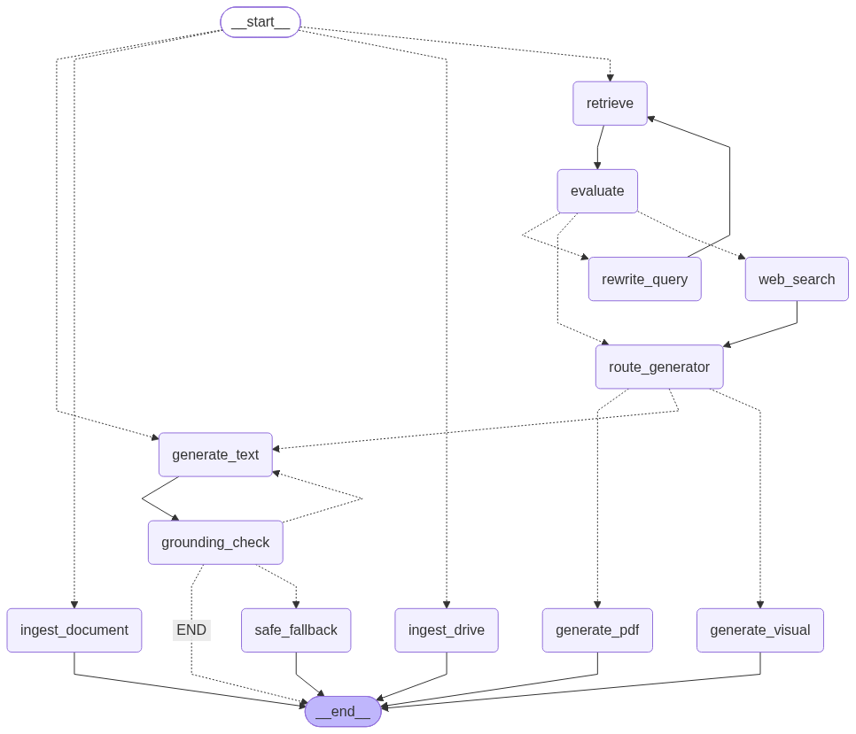

🎓 Agentic Study Assistant : CRAG & Self-RAG Multimodal


## 📌 Contexte et Problématique
Dans les cycles d'ingénierie, la recherche d'informations précises dans des centaines de pages de cours ou de schémas d'architecture est fastidieuse. Les solutions basées sur les LLMs génériques ou le RAG (Retrieval-Augmented Generation) classique présentent des failles majeures : 
1. **Hallucinations** : Le LLM invente des réponses lorsque la recherche vectorielle échoue silencieusement.
2. **Manque de réflexion** : Le système se contente du premier contexte trouvé sans vérifier sa pertinence.
3. **Absence de multimodalité** : Les étudiants ont besoin de résumés PDF et de schémas conceptuels, pas seulement de texte brut.

## 🎯 Solution : Architecture Agentique Avancée
Ce projet implémente un pipeline agentique de bout en bout orchestré par **LangGraph**, intégrant les concepts de **CRAG (Corrective RAG)** et **Self-RAG**. 

Le système évalue activement le contexte récupéré dans la base vectorielle. Si le contexte est jugé insuffisant, un agent reformule la question et relance une recherche. Si l'échec persiste, le système peut basculer vers une recherche Web. Enfin, le système vérifie ses propres réponses pour garantir l'absence totale d'hallucinations avant de les afficher.

---

## 🔄 Workflow : Le Parcours d'une Question
Lorsqu'un utilisateur pose une question dans l'interface, celle-ci traverse une série d'étapes de validation et de réflexion avant que la réponse ne soit affichée :

1. **Saisie Utilisateur :** La requête est envoyée depuis l'interface React vers l'API FastAPI avec son `session_id` unique pour garantir l'isolation des données.
2. **Orchestration Initiale :** Le nœud d'entrée du graphe LangGraph détermine le type d'entrée (Lien Drive, Document, Question ou Salutation). Si c'est une simple salutation, il passe directement à la génération textuelle. Sinon, il l'envoie vers le moteur de recherche.
3. **Récupération Vectorielle (Retrieval) :** Le système interroge ChromaDB pour extraire les fragments de cours les plus pertinents liés au `session_id` actif (intégrant un potentiel Reranker).
4. **Évaluation CRAG :** Un agent LLM strict lit les fragments extraits et leur attribue un score de pertinence (`correct`, `ambiguous`, ou `incorrect`). 
5. **Boucle de Correction (CRAG Router) :**
   * **Reformulation :** Si le score est insuffisant et qu'aucune tentative n'a encore été faite, un agent dédié réécrit la question initiale.
   * **Nouvelle Recherche :** Le système relance l'interrogation de la base de données.
   * **Fallback Web :** Si la deuxième recherche échoue (ou est jugée insuffisante) et que l'utilisateur a activé le "Mode Web", le système interroge DuckDuckGo pour enrichir le contexte.
6. **Analyse d'Intention :** Un agent classifieur lit la demande pour déterminer le format de sortie attendu (Texte standard, Schéma conceptuel, ou Rapport PDF).
7. **Génération :** Le LLM spécialisé rédige la réponse (en Markdown, en code Graphviz, ou en HTML/CSS) en se basant *exclusivement* sur le contexte validé.
8. **Auto-Vérification (Grounding/Self-RAG) :** Pour les réponses textuelles, un agent de contrôle vérifie que le texte généré ne contient aucune hallucination. Si une information inventée est détectée, un feedback strict est renvoyé au générateur qui doit recommencer (jusqu'à 2 essais).
9. **Safe Fallback :** Si le générateur échoue de manière répétée au test d'anti-hallucination, un message de sécurité est renvoyé ("Je n'ai pas assez d'informations pour répondre avec précision").
10. **Restitution Finale :** La réponse formatée, garantie fiable et sourcée, est transmise au frontend et affichée à l'utilisateur.

---

## 🧠 Composants Clés

L'application repose sur un écosystème d'agents spécialisés orchestrés par LangGraph, interagissant avec une mémoire vectorielle.

*   **L'Orchestrateur LangGraph (`agent/graph.py`) :** Le cœur du système. Il modélise le graphe d'états (StateGraph), définissant l'enchaînement conditionnel entre les nœuds d'ingestion, de récupération, d'évaluation, et de génération.

*   **Pipeline d'Ingestion & Data Engineering (`ingestion/pipeline.py`) :** Gère l'extraction de texte de documents locaux ou Google Drive. Utilise `PyMuPDF` pour le texte, suivi d'un découpage sémantique (Text Splitter).
*   **Mémoire Vectorielle & Reranker (`vectorstore/chroma_client.py`, `agent/reranker.py`) :** Utilise ChromaDB avec un embedding `multilingual-MiniLM` pour une recherche de similarité ultra-rapide. **L'isolation des sessions** est garantie par un `session_id` unique pour chaque utilisateur. Un Reranker optimise ensuite l'ordre des documents retournés.
*   **L'Évaluateur CRAG (`agent/evaluator.py`) :** L'agent critique (Llama-3) qui note de manière rigoureuse la pertinence du contexte extrait par rapport à la question. Il bloque les mauvais contextes.
*   **Le Reformulateur de Requête (`agent/query_rewriter.py`) :** Si le contexte est jugé insuffisant par l'évaluateur, cet agent réécrit intelligemment la question de l'utilisateur pour améliorer la prochaine recherche vectorielle.
*   **L'Outil de Recherche Web (`tools/web_search.py`) :** Le filet de sécurité (Fallback). Si le cours interne ne suffit pas, et si le bouton "Mode Web" est activé dans l'interface React, cet outil interroge le web via DuckDuckGo.
*   **Le Classifieur d'Intention (`agent/generator_router.py`) :** Analyse la question pour déterminer si l'utilisateur souhaite une explication textuelle, un schéma, ou un rapport de synthèse PDF, puis le route vers le bon pipeline.
*   **Les Générateurs Multimodaux :**
    *   **Textuel (`agent/text_generator.py`) :** Synthèse Markdown pédagogique intégrant le contexte.
    *   **Visuel (`agent/visual_generator.py`, `agent/generate_graph_png.py`) :** Génération autonome de code Graphviz (DOT) compilé en images (schémas conceptuels, architectures).
    *   **Rapport PDF (`agent/pdf_generator.py`) :** Génération dynamique de code HTML/CSS thématique, puis compilation via WeasyPrint pour fournir des rapports PDF professionnels.
*   **Le Grounding Checker (Self-RAG) (`agent/self_rag_evaluators.py`) :** Le dernier rempart anti-hallucination. Il relit la réponse finale générée et s'assure qu'absolument aucun fait non-présent dans le contexte validé n'a été inventé.

---

## 🚀 Déploiement (Docker Compose)

L'architecture est entièrement conteneurisée (Backend FastAPI + Frontend React/Vite + ChromaDB).

**Prérequis :**
- Docker & Docker Compose
- Clé API Groq (Modèle Llama 3)

**Installation :**

1. Clonez le projet et configurez l'environnement :
   ```bash
   cp infra/.env.example infra/.env
   # Insérez votre GROQ_API_KEY dans le fichier .env
   ```

2. Lancez les services via Docker :
   ```bash
   cd infra
   sudo docker compose up --build -d
   ```

3. Accédez aux interfaces :
   - **Frontend (React)** : http://localhost:5173
   - **API Docs (FastAPI/Swagger)** : http://localhost:8000/docs