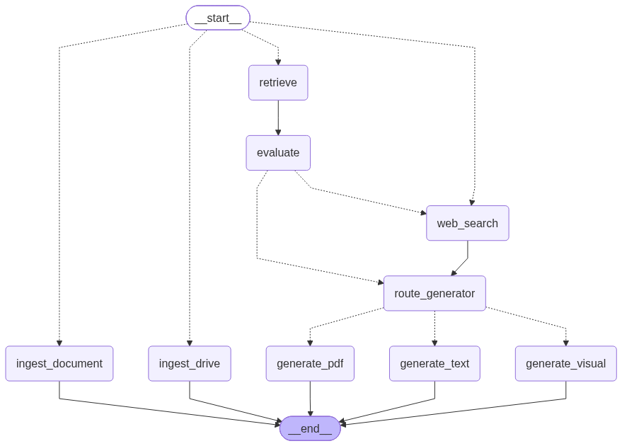

# 🎓 Agentic Study Assistant

**Agentic Study Assistant** est une application web intelligente basée sur l'architecture **CRAG (Corrective Retrieval-Augmented Generation)**. Conçue pour aider les étudiants et les professionnels, elle permet d'ingérer des cours et des documents, d'interroger la base de connaissances, et de générer automatiquement des réponses textuelles, des schémas visuels, ou des rapports PDF complets.

---

## ✨ Fonctionnalités Principales

- 📂 **Ingestion Multi-Sources** : Téléchargez des documents locaux (PDF, images) ou synchronisez directement un dossier Google Drive public.
- 🔍 **RAG avec Fallback Web (CRAG)** : L'application recherche d'abord dans vos documents. Si la réponse n'y est pas ou est ambiguë, elle effectue automatiquement une recherche Web (DuckDuckGo) pour compléter l'information.
- 💬 **Assistant Conversationnel** : Discutez naturellement avec vos cours via une interface Streamlit fluide.
- 🎨 **Génération de Schémas (Graphviz)** : Demandez à l'agent de générer des schémas, des architectures ou des logigrammes. L'agent écrit du code DOT qui est automatiquement compilé en PNG/PDF.
- 📄 **Génération de Rapports PDF Dynamiques** : Demandez un résumé au format PDF en précisant vos attentes (thème de couleurs, nombre de pages, axes de focus). L'agent créera un document HTML stylisé intégrant textes et diagrammes, compilé ensuite en PDF (via WeasyPrint).
- 🛡️ **Anti-Hallucination** : Les agents sont paramétrés pour se baser strictement sur le contexte fourni, garantissant des réponses fiables.

---

## 🛠️ Stack Technique

- **Interface Utilisateur** : [Streamlit](https://streamlit.io/)
- **Orchestration Agentique** : [LangGraph](https://python.langchain.com/docs/langgraph/)
- **Agents & LLM** : [Agno](https://github.com/agno-ai/agno) avec les modèles **Groq** (ex: `openai/gpt-oss-120b`).
- **Base Vectorielle (Vector Store)** : [ChromaDB](https://www.trychroma.com/)
- **Génération Visuelle & PDF** : `Graphviz`, `WeasyPrint`
- **Déploiement** : Docker & Docker Compose

---

## 🚀 Installation & Lancement

L'application est entièrement conteneurisée pour garantir une installation facile et reproductible.

### Prérequis
- [Docker](https://docs.docker.com/get-docker/) et [Docker Compose](https://docs.docker.com/compose/install/) installés sur votre machine.
- Une clé API Groq (ou OpenAI selon la configuration).

### Étapes

1. **Cloner le dépôt** :
   ```bash
   git clone https://github.com/votre-utilisateur/agentic-study-assistant.git
   cd agentic-study-assistant
   ```

2. **Configurer l'environnement** :
   Créez un fichier `.env` dans le dossier `infra/` en vous basant sur le potentiel fichier `.env.example` :
   ```bash
   # infra/.env
   GROQ_API_KEY=votre_cle_api_ici
   # Ajoutez toute autre variable d'environnement nécessaire
   ```

3. **Lancer avec Docker Compose** :
   ```bash
   cd infra
   docker-compose up --build -d
   ```

4. **Accéder à l'application** :
   Ouvrez votre navigateur et allez sur : **[http://localhost:8501](http://localhost:8501)**

---

## 🏗️ Architecture du Graphe (LangGraph)

L'intelligence de l'application repose sur un graphe d'états qui route la demande de l'utilisateur.



Voici l'explication de chaque composante du workflow :

1. **__start__ / orchestrator_router** : Point d'entrée du graphe. Il analyse si l'entrée de l'utilisateur est un lien Drive, un document local, ou une question, et route le flux vers le nœud approprié.
2. **ingest_drive & ingest_document** : Nœuds responsables de l'ingestion. Ils téléchargent les fichiers, appliquent l'OCR si nécessaire, découpent le texte (chunking) et l'indexent vectoriellement dans ChromaDB. Le processus s'arrête après cette étape.
3. **retrieve** : Lorsqu'une question est posée, ce nœud interroge ChromaDB pour récupérer les extraits de cours les plus pertinents (Retrieval).
4. **evaluate** : C'est le cœur du système **CRAG**. Un agent LLM évaluateur vérifie si le contexte récupéré est pertinent pour répondre à la question. S'il est correct, le flux passe à la génération. S'il est incorrect ou ambigu, la recherche web est déclenchée.
5. **web_search** : Nœud de secours (Fallback Web). Il utilise DuckDuckGo pour chercher l'information manquante sur internet et l'ajoute au contexte ("AJOUT WEB").
6. **route_generator** : Nœud de classification d'intention. Il analyse la question pour déterminer le format attendu par l'utilisateur et redirige vers le bon générateur.
7. **Les Générateurs Finaux** :
   - **generate_text** : Rédige une réponse textuelle pédagogique et formatée.
   - **generate_visual** : Conçoit du code `Graphviz` et le compile pour générer directement une image de schéma ou de logigramme.
   - **generate_pdf** : Crée un rapport de synthèse dynamique et complet (intégrant structure HTML, thèmes CSS, et schémas générés en temps réel) et le compile en PDF avec `WeasyPrint`.

---

## 🧹 Gestion des données

Vous pouvez à tout moment purger la base de données vectorielle ChromaDB via le bouton "🗑️ Purger la base de connaissances" présent dans la barre latérale de l'application. Cela supprimera les embeddings et les fichiers temporaires stockés localement.
